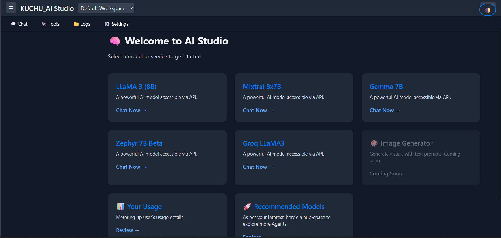
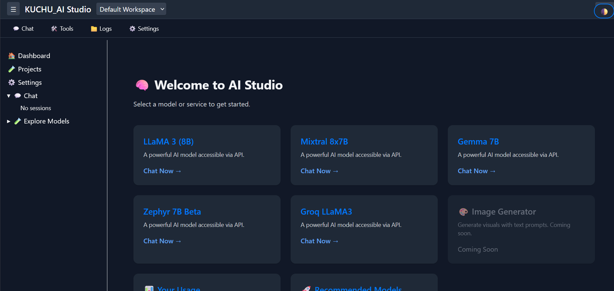

# 🧠 Conversation AI Studio

A lightweight FastAPI-powered application that brings multiple LLMs (Groq, Together.ai, etc.) under one unified chat interface — inspired by the ChatGPT experience.

---

## 📦 Features

- ✅ Unified chat UI (input box fixed at bottom)
- ✅ Sidebar navigation for agent selection
- ✅ Integrated LLMs:
  - [x] Groq (LLaMA 3)
  - [x] Together.ai (Mixtral, LLaMA, etc.)
- ✅ Clean and modular app layout
- ✅ Background image support
- ✅ Agent-agnostic routing system

---

## 📁 Project Structure

```AI-Studio/
├── chat_client/ # LLM clients
│ ├── groq_client.py
│ └── together_ai.py
├── studio/
│ ├── main.py # FastAPI app
│ ├── templates/ # Jinja2 templates
│ │ ├── index.html
│ │ └── chat.html
│ ├── static/ # CSS & background
│ │ ├── style.css
│ │ └── background.jpg
├── .env # API keys
├── requirements.txt
└── README.md```
```


---

## 🚀 Getting Started

### 1. Clone the repo

```bash
git clone https://github.com/your-username/ai-studio.git
cd AI-Studio
```

### 2. Create virtual environment

```
python -m venv venv
source venv/bin/activate   # On Windows: venv\Scripts\activate
```

### 3. Install dependencies
```
pip install -r requirements.txt
```

### 4. Add your .env file
```
# .env
GROQ_API_KEY=your_groq_key_here
TOGETHER_API_KEY=your_together_key_here
```

## 🧪 Run the App
```
uvicorn studio.main:app --port 8030 --reload
```




Preview chats




## Tailwind integration for Studio app beautification. 
