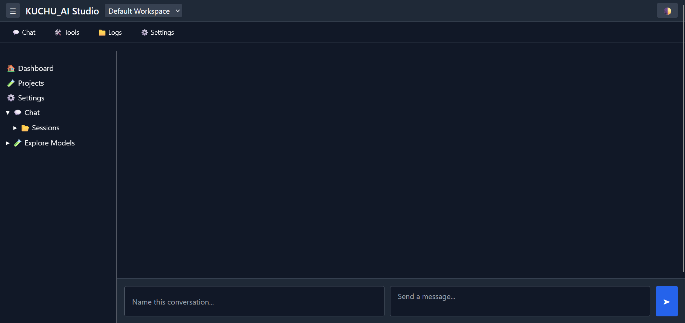
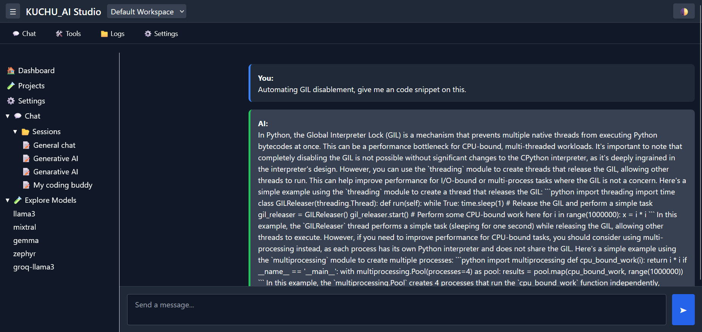
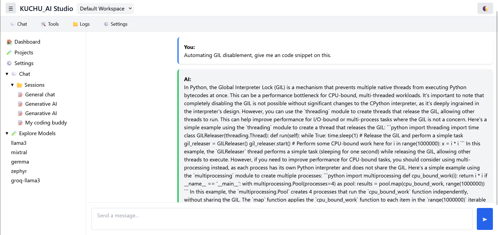

# 🧠 Conversation AI Studio

A lightweight FastAPI-powered application that brings multiple LLMs (Groq, Together.ai, etc.) under one unified chat interface — inspired by the ChatGPT experience.

---

## 📦 Features

- ✅ Unified chat UI (input box fixed at bottom)
- ✅ Sidebar navigation for agent selection
- ✅ Integrated LLMs:
  - [x] Groq (LLaMA 3)
  - [x] Together.ai (Mixtral, LLaMA, etc.)
- ✅ Clean and modular app layout
- ✅ Background image support
- ✅ Agent-agnostic routing system

---

## 📁 Project Structure

```AI-Studio/
├── chat_client/ # LLM clients
│ ├── groq_client.py
│ └── together_ai.py
├── studio/
│ ├── main.py # FastAPI app
│ ├── templates/ # Jinja2 templates
│ │ ├── index.html
│ │ └── chat.html
│ ├── static/ # CSS & background
├── .env # API keys
├── requirements.txt
└── README.md```
```


---

## 🚀 Getting Started

### 1. Clone the repo

```bash
git clone https://github.com/your-username/ai-studio.git
cd AI-Studio
```

### 2. Create virtual environment

```
python -m venv venv
source venv/bin/activate   # On Windows: venv\Scripts\activate
```

### 3. Install dependencies
```
pip install -r requirements.txt
```

### 4. Add your .env file
```
# .env
GROQ_API_KEY=your_groq_key_here
TOGETHER_API_KEY=your_together_key_here
```

### Set Project path in Pythonpath before executing the main script
set PYTHONPATH=%cd%
export PYTHONPATH=/home/ubuntu/AI-Studio  # adjust as per your path


## 🧪 Run the App
```
uvicorn studio.main:app --port 8030 --reload
```

### For locally test app from edge devices. 
```
uvicorn studio.main:app --host 0.0.0.0 --port 8030 --reload
```


## Application Updates
### Dashboard


### Dashboard with toggle


### Conversation - Context management 
 

### Application utilities & customize experience for a better accessability. 


#### For a better experience, application is build in a light weight manner. 


## Tailwind integration for Studio app beautification. 

* Tailwind adopted. 
* Multiple sideload has added. 
* Modularize & saperating different sub features as a microservice so application load time will be reduced. 


## Import-Export context file for context management. 

### This is for import [When user wants to load any specific context from file system]

`curl -X POST http://localhost:8030/tools/context_manager/context/import \  -F "file=@context1.json"`

### This is for export [When user wants to save any specific context from on-going communication]

`curl -X GET http://localhost:8030/tools/context_manager/context/export --output downloaded_context.json`

